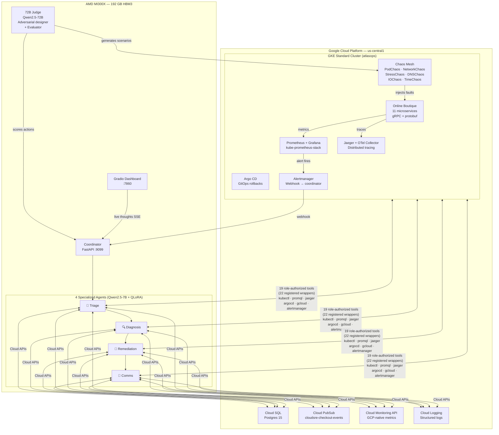
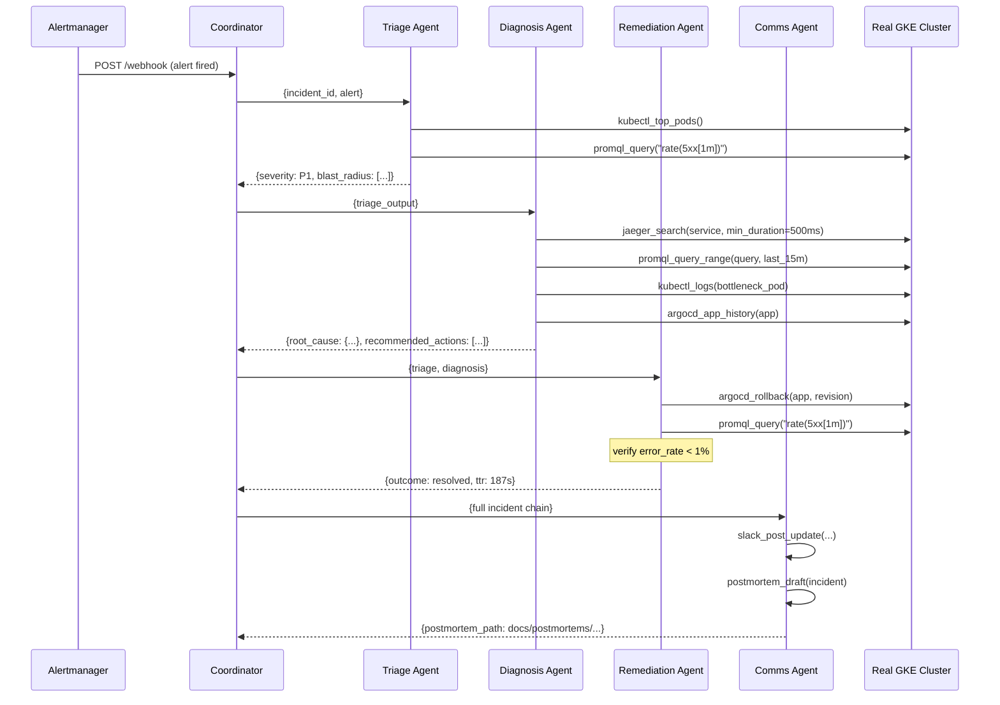

# AtlasOps — Architecture

## System Overview



---

## Agent Chain



---

## AMD MI300X Co-hosting

```
AMD MI300X (192 GB HBM3)
┌─────────────────────────────────────────────────────────┐
│                                                         │
│  Qwen2.5-7B base (4-bit NF4)           ~4 GB           │
│  ├─ triage_adapter    (LoRA r=16)      ~40 MB           │
│  ├─ diagnosis_adapter (LoRA r=16)      ~40 MB           │
│  ├─ remediation_adapter (LoRA r=16)    ~40 MB           │
│  └─ comms_adapter     (LoRA r=16)      ~40 MB           │
│                                                         │
│  Qwen2.5-72B (4-bit NF4)               ~37 GB           │
│  └─ Adversarial designer + judge                        │
│                                                         │
│  Total used: ~41 GB    Available: ~151 GB               │
│                                                         │
│  ❌ A100 (80 GB): can fit judge OR agents, not both     │
│  ❌ T4   (16 GB): can't fit even the 7B base            │
│  ✅ MI300X: all 5 models + room to spare                │
└─────────────────────────────────────────────────────────┘
```

---

## Training Pipeline

```mermaid
flowchart LR
    A["Real GKE Cluster<br/>11 live microservices"] -->|Chaos Mesh injects faults| B
    B["Alertmanager fires<br/>real webhook"] --> C
    C["4 agents run<br/>against live cluster"] --> D
    D["72B judge scores<br/>tool calls + outcomes"] --> E
    E["5k trajectory corpus<br/>data/sft_corpus.jsonl<br/>reward_contract included"]

    E --> F["Stage 1: QLoRA SFT<br/>Qwen2.5-7B + LoRA r=16<br/>4-bit NF4 on MI300X"]
    F --> G["Stage 2: GRPO<br/>Optuna HP search (6 trials)<br/>num_gen=8, cosine LR<br/>tier-aware reward contract"]
    G --> H["4 role adapters<br/>~40 MB each<br/>checkpoints/grpo_v3/"]

    H -->|"hot-swap adapters<br/>per agent call"| I["Production serving<br/>vLLM on MI300X"]
```



---

## 22 Registered Tool Wrappers, 19 Agent-Exposed

```
kubectl (8)          promql (2)          jaeger (2)
─────────────        ──────────          ──────────
kubectl_get          promql_query        jaeger_search
kubectl_describe     promql_query_range  jaeger_get_trace
kubectl_logs
kubectl_top_pods     argocd (4)          gcloud (2)
kubectl_top_nodes    ─────────           ──────────
kubectl_rollout      argocd_list_apps    gcloud_logs_read
kubectl_scale        argocd_app_history  cloud_monitoring_query
kubectl_exec         argocd_rollback
                     argocd_app_get

alertmanager (2)     comms (2)
────────────────     ──────────
alertmanager_silence slack_post_update
alertmanager_list_alerts
                     postmortem_draft
```

AtlasOps registers 22 wrappers across Kubernetes, tracing, metrics, GitOps, and
communications. Role ACLs expose 19 wrappers to autonomous agents.
`argocd_app_get`, `kubectl_top_nodes`, and high-risk `kubectl_exec` remain
registered for explicit administrative/library use but are not agent-exposed.

---

## Reward Contract (Anti-Gaming)

```
reward = 0.35 × resolve                    # did the incident get fixed?
       + 0.20 × evidence                   # was the root cause proven with data?
       + 0.20 × safety                     # was the action minimum-blast-radius?
       + 0.15 × speed                      # logistic decay — fast is good, race-to-zero is penalised
       + 0.10 × comms                      # was a postmortem generated?

       - 0.10  if turns > 40              # command spam
       - 0.25  if claimed resolved but wasn't  # false resolution
       - 0.20  if efficiency < 0.3        # unsafe shortcut
       - 0.20  if reasoning AND correctness both low  # hallucinated evidence
       - 0.10  if silenced an alert without resolving # over-silencing

tier adjustments:
  cascade:      r_evidence weight ↑ (tracing the chain matters more)
  multi_fault:  r_safety weight ↑   (conservative action matters more)
  adversarial:  all penalties × 1.25 (harder tier, stricter scoring)
```
