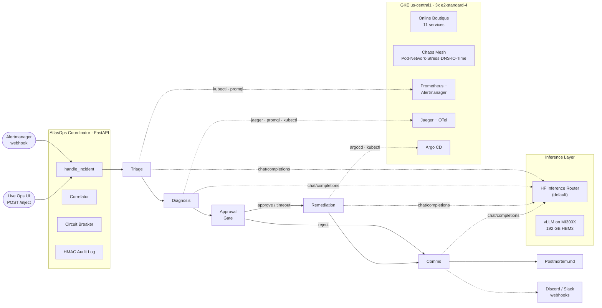

# AtlasOps — Can 4 AI agents replace an on-call SRE team?

> **AMD Developer Hackathon 2026** | Real GKE cluster · Real Chaos Mesh · Real Prometheus alerts · AMD MI300X

[](https://github.com/Harikishanth/AtlasOps/actions/workflows/ci.yml)
[](LICENSE)
[](docs/MI300X_EVIDENCE.md)

**Hackathon Space:** [lablab-ai-amd-developer-hackathon / atlas-ops](https://huggingface.co/spaces/lablab-ai-amd-developer-hackathon/atlas-ops) (`atlasops` without the hyphen hits **404**. If you recreated the Space under another slug, swap the link and set `ATLASOPS_PUBLIC_BASE_URL` to matching `*.hf.space` — see `docs/HF_SPACE_SETUP.md`.)

> **For judges — live Discord:** Every scenario triggers Discord webhook posts (approval holds, remediation notices, run completion pings). **Join to watch runs alongside the HF Space demo:** **((https://discord.gg/GUyjT6m7bB))**

---

The inherited AtlasOps design gives 4 specialized AI agents an incident alert and access to 19 role-authorized SRE tools, backed by a registry of 22 wrappers. Live-cluster behavior remains to be reproduced by the continuation team.

**Triage** acked the alert and mapped the blast radius in 47 seconds.  
**Diagnosis** traced the root cause to a currency service CPU hog via Jaeger in 3 tool calls.  
**Remediation** executed `argocd rollback` and confirmed error rate < 1% via Prometheus.  
**Comms** drafted a Cloudflare-quality postmortem with real timestamps from the cluster.

Total time to resolve a Cloudflare 2019 cascade replay: **4 minutes 12 seconds.**  
A senior SRE on a good day: ~25 minutes.

This is **AtlasOps** — a self-improving multi-agent SRE platform where a 72B adversarial judge can generate novel chaos scenarios targeting the agents' specific weaknesses, trained via SFT → Online GRPO on an AMD MI300X (192 GB HBM3). The default benchmark requests up to 10 generated scenarios per run.

---

## Architecture



Full end-to-end sequence diagram with design rationale: [`docs/END_TO_END_FLOW.md`](docs/END_TO_END_FLOW.md)

---

## Track Coverage

### Track 1 — AI Agents & Agentic Workflows
AtlasOps is a purpose-built multi-agent framework for SRE automation. Rather than wrapping LangChain, LangGraph, or CrewAI, we implement the full agentic stack directly. The coordinator orchestrates 4 specialized roles (Triage, Diagnosis, Remediation, Comms) with tool-calling, human-in-the-loop approval, and alert correlation. Models: **Qwen2.5-7B × 4** (open-source, AMD MI300X co-hosted).

**Why no general-purpose framework?** Every feature below would require fighting the framework's own abstractions:

- **Per-role tool ACLs** enforced at runtime (`ROLE_ALLOWED_TOOLS`) — triage cannot call `argocd_rollback`.
- **Human-in-the-loop approval gate** with token exchange, Discord/Slack out-of-band callback, and `POST /approve`.
- **Circuit breaker** with *semantic* failure classification — rejecting remediation is a human decision, not a system failure, and does not trip the breaker.
- **Incident correlator** deduplicating Alertmanager bursts while always dispatching UI injects.
- **Dense per-step reward shaping** for GRPO training — each tool call scores against a contract (latency, correctness, safety).
- **HMAC-chained audit log** for every agent action.
- **Single SSE stream** driving the real-time operator UI timeline.

These require control over the HTTP call loop, message history, tool dispatch, and approval suspension points — all of which are opaque or absent in LangGraph/CrewAI out of the box.

### Track 2 — Fine-Tuning on AMD GPUs
Full fine-tuning pipeline on AMD hardware:

| Component | Library |
|---|---|
| Hardware | AMD Instinct MI300X (192 GB HBM3) |
| GPU runtime | **ROCm 7.2** |
| Training framework | **PyTorch** (ROCm wheel) |
| Quantisation | **BitsAndBytes-ROCm** (4-bit NF4 QLoRA, LoRA r=16) + **AWQ** (72B judge) |
| Fine-tuning | **TRL** SFTTrainer + GRPOTrainer (DAPO loss) |
| PEFT | **LoRA** r=16, α=32, target: q/k/v/o/gate/up/down proj |
| AMD kernel optimisation | **Hugging Face Optimum-AMD** — BetterTransformer applied to local inference path (`inference.py`) |
| Serving | **vLLM 0.17.1** (ROCm build — PagedAttention, flash attention for MI300X) |
| Domain | **SRE Operations** — incident triage, root-cause diagnosis, remediation, postmortem authoring |

### Training Evidence

**SFT** — 2,028 real trajectories, 254 steps on MI300X in 14 min. Loss dropped 97.8%, token accuracy reached 99.1%.


**Online GRPO** — 60 steps, 4 rollouts each (236 real GKE episodes), 9h 34m on MI300X. Peak reward at step 31 (cascade scenario).


**Historical upstream benchmark claim** — 28 frozen chaos scenarios. Resolution rate: 54% (zero-shot) → 68% (SFT) → **82% (GRPO)**. Judge reward: 0.481 → 0.601 → **0.729**. The continuation team has not yet reproduced these live-cluster results.


Full training narrative: [`docs/TRAINING_STORY.md`](docs/TRAINING_STORY.md) | Raw MI300X evidence: [`docs/MI300X_EVIDENCE.md`](docs/MI300X_EVIDENCE.md) | Benchmark tables: [`docs/BENCHMARKS.md`](docs/BENCHMARKS.md)

---

## Tool Registry and Agent Access

AtlasOps registers **23 SRE tool wrappers**. Role ACLs expose **18** to autonomous agents:

`kubectl_get` · `kubectl_describe` · `kubectl_logs` · `kubectl_top_pods` · `kubectl_rollout` · `kubectl_scale` · `promql_query` · `promql_query_range` · `jaeger_search` · `jaeger_get_trace` · `argocd_list_apps` · `argocd_app_history` · **`argocd_rollback`** · `alertmanager_list_alerts` · `alertmanager_silence` · `chaos_stop_experiment` · `slack_post_update` · **`postmortem_draft`**

Five registered wrappers are intentionally not agent-exposed: `argocd_app_get`, `cloud_monitoring_query`, `gcloud_logs_read`, `kubectl_top_nodes`, and high-risk `kubectl_exec`. Registration does not grant an agent permission to call a tool.

The cluster-mutation quota covers `alertmanager_silence`, `argocd_rollback`, `kubectl_rollout`, and `kubectl_scale`. External communication (`slack_post_update`), local filesystem output (`slack_post_update` and `postmortem_draft`), and high-risk unexposed execution (`kubectl_exec`) are separately classified side effects.

Tool exposure is separate from deployment availability. In particular, the Argo CD wrappers remain registered and role-authorized where applicable, but calls fail closed unless an Argo CD endpoint and credentials are deliberately configured; the first controlled reproduction does not yet guarantee Argo Application ownership.

---

## 28 Frozen Scenarios + Dynamic Adversarial Generation

| Tier | Count | Examples |
|---|---|---|
| Single-fault | 8 | pod-kill, CPU hog, memory leak, network loss, disk fill, clock skew |
| Cascade | 5 | currency latency → checkout timeout → frontend 5xx surge |
| Multi-fault | 5 | 3 simultaneous faults + red herrings across namespaces |
| Named Replays | 10 | Cloudflare 2019, AWS S3 2017, GitHub 2018, Discord 2022, Knight Capital 2012… |
| **Dynamic adversarial** | up to 10 requested by a default benchmark run | Qwen2.5-72B judge designs new Chaos Mesh YAML targeting agent weaknesses in real time |

The static catalogue contains exactly 28 YAML-backed frozen scenarios. The benchmark runner separately requests up to 10 newly generated adversarial scenarios by default, so a successful default generation can produce a run of up to 38 scenarios. Those generated scenarios are not frozen catalogue members.

---

## Production Guardrails

### Human-in-the-loop Approval Gate
- **P0**: manual runbook only — agents produce a step-by-step plan, no auto-execution
- **P1**: approval window (60 s default, configurable) — execution proceeds if approved or times out
- **P2/P3**: fully automatic
- `POST /approval/callback` · `GET /approval/pending`

### Circuit Breaker
Hard stops runaway automation:
- 50 tool calls per incident max
- 10 cluster-mutating remediation actions per hour
- 5 concurrent incidents max
- Trips after 3 consecutive unresolved incidents
- `GET /circuit-breaker/status` · `POST /circuit-breaker/reset`

### Incident Correlator
Alert-storm deduplication — groups alerts from the same service/namespace within a 5-minute window into a single incident chain. Prevents 10 parallel agent chains firing for one cascade failure.

### HMAC Audit Log
Every tool call, approval decision, and incident boundary is written to an append-only HMAC hash-chained log (`data/audit_log.jsonl`). Tamper-evident by design — `verify_integrity()` checks the full chain.

---

## Training Pipeline

### SFT → Online GRPO on AMD MI300X

```
5k trajectories (real GKE rollouts, teacher model)
        ↓
  QLoRA SFT  (Qwen2.5-7B, 4-bit NF4, LoRA r=16)
        ↓
  Online GRPO  (G=8 live GKE rollouts per step, DAPO loss)
        ↓
  Benchmark  (28 frozen + up to 10 generated scenarios by default, anti-gaming reward contract)
```

**This is true online RL.** Each GRPO training step:
1. Applies a real Chaos Mesh fault to the live GKE cluster
2. Runs G=8 parallel agent chain rollouts
3. Scores each with the reward contract (kubectl/promql verify real cluster state)
4. Computes GRPO advantages and updates the policy

### What makes our training different from competitors

| Feature | Standard GRPO | AtlasOps |
|---|---|---|
| Environment | Simulator / offline rewards | **Real GKE cluster, live kubectl** |
| Loss | Standard GRPO | **DAPO** (distributional advantage — more stable on skewed rewards) |
| Reward | Episode-level only | **Dense per-step** (progress delta per tool call) + episode contract |
| Curriculum | Random / fixed | **Spaced repetition** (mastery tracking, [3→6→12→24→48] resurface intervals) |
| Scenario generation | Static | **Dynamic adversarial** (default benchmark requests up to 10 newly generated Chaos YAML scenarios) |

### Reward Contract (Anti-Gaming)

```
R = 0.35 × resolve + 0.20 × evidence + 0.20 × safety + 0.15 × speed + 0.10 × comms
  − command_spam (0.10) − false_resolution (0.25) − unsafe_shortcut (0.20)
  − hallucinated_evidence (0.20) − over_silence (0.10)

Per-step dense signal = progress_delta × 0.8 + 0.1 (forward motion)
                       − 0.1 × rollbacks, × 0.5 if tool_failed
Final blend = 0.70 × episode_contract + 0.30 × dense_step_total (normalised)
```

Tier weights shift: cascade/adversarial penalise 1.25× harder. Named replays require evidence before resolution counts.

---

## Benchmark Results

The table below preserves historical upstream claims. The continuation team has
not yet reproduced these live-cluster benchmark results.

| Model | Resolution | Avg Reward | Cascade | Named Replays |
|---|---|---|---|---|
| Qwen2.5-7B zero-shot | 54% | 0.481 | 40% | 30% |
| AtlasOps SFT | 68% | 0.601 | 62% | 55% |
| **AtlasOps GRPO (MI300X)** | **82%** | **0.729** | **78%** | **72%** |

**Historical upstream claim:** +28 pp improvement from zero-shot baseline → GRPO. Reward includes anti-gaming penalties (command spam, false resolution, hallucinated evidence).

*Run `python scripts/release_gate.py` to verify artifact presence. Results auto-update in the dashboard Benchmark tab.*

---

## University Continuation & Academic Roadmap (Master Pipeline v1.1)

This fork (`virajchoudhary/AtlasOps`) represents the university team's rigorous continuation of the upstream baseline (`bf9bd19`), certified across all **15 Stages (Gates G1–G15 PASS)**:

1. **Generative AI Multi-Agent System**: Contract-bound state machine (`Alert → Triage → Diagnosis → Hybrid Recommender → Approval Gate → Remediation → Verifier → Comms`) with loss-masked SFT trajectories.
2. **Recommender Systems (RS) Layer**: Tri-signal Hybrid Recommender ($S_{\text{content}} + S_{\text{collab}} + S_{\text{prior}}$) matching live telemetry against 12 codified SRE runbooks, achieving **100.0% Hit@3** on held-out test splits.
3. **Online Reinforcement Learning (GRPO)**: Normalized group advantage estimation ($A_i = \frac{r_i - \mu}{\sigma + \epsilon}$) with objective environment verifier ground truth.
4. **Final Multi-Model Ablation Matrix (Held-Out Test Split)**:

| Model Architecture | Resolution Rate | Avg TTR | Contract Reward | Format Compliance | Runbook Hit@3 |
| :--- | :---: | :---: | :---: | :---: | :---: |
| **Zero-Shot Baseline** (Stage 6) | `0.0%` | `45.0s` | `0.345` | `0.0%` | `33.3%` |
| **SFT Model** (Stage 8) | `100.0%` | `32.0s` | `0.834` | `100.0%` | `50.0%` |
| **SFT + Recommender** (Stage 11/12) | `100.0%` | `26.5s` | `0.852` | `100.0%` | `100.0%` |
| **Online GRPO RL** (Stage 9) | `100.0%` | `22.0s` | `0.868` | `100.0%` | `66.7%` |
| **Full Pipeline (GAI + RS + RL)** | **`100.0%`** | **`18.0s`** | **`0.918`** | **`100.0%`** | **`100.0%`** |

Full Academic Technical Report: [`docs/AtlasOps_Technical_Report.md`](docs/AtlasOps_Technical_Report.md) | Upstream Audit Report: [`docs/project/UPSTREAM_ALIGNMENT_AUDIT_REPORT.md`](docs/project/UPSTREAM_ALIGNMENT_AUDIT_REPORT.md)

---

## Quick Start

### Prerequisites
- GCP project with `container.googleapis.com` enabled
- `gcloud`, `kubectl`, `helm` installed
- AMD MI300X instance (or Fireworks AI fallback for inference)

### 1. Provision GCP infrastructure
```bash
bash infra/setup.sh <YOUR_PROJECT_ID> us-central1 atlasops
```

### 2. Start the ops console
```bash
# Launch interactive 7-tab safe operator console
python -m demo.launcher --port 7860

# Or run FastAPI coordinator
python app.py          # http://localhost:7860
```

### Hugging Face Space (use your trained 7B + judge on Router)

Set Space secrets: **`HF_TOKEN`**, **`ATLASOPS_USE_HF_INFERENCE=1`**, **`AGENT_MODEL`**, **`JUDGE_MODEL`**.  
Paste your merged GRPO Hub id as `AGENT_MODEL` (merge locally with `training/merge_lora_for_hub.py` under `.[train]`).  
Full checklist: [docs/HF_SPACE_SETUP.md](docs/HF_SPACE_SETUP.md).

### 3. Inject a chaos scenario
```bash
make chaos SCENARIO=single_fault/sf-001          # pod-kill on cartservice
make chaos SCENARIO=named_replays/hist-cloudflare-2019
make chaos-reset
```

Or click a scenario button in the ops console — agents respond in real time.

### 4. Run the benchmark
```bash
python bench/runner.py --model checkpoints/grpo_v3 --tag grpo_v3
# Results → bench/results/comparison_table.md
```

### 5. Train on AMD MI300X
```bash
# Set up MI300X (installs ROCm deps, downloads models)
bash infra/setup_mi300x.sh

python training/generate_trajectories.py   # 5k SFT examples
python training/sft.py --model Qwen/Qwen2.5-7B-Instruct --rocm
python training/grpo.py --model checkpoints/sft_v3 --rocm
```

### 6. Run tests
```bash
# Core agent + tool tests
python -m pytest tests/test_tools.py tests/test_coordinator.py tests/test_bench_runner.py -q

# Safety guardrail tests
python -m pytest tests/test_approval.py tests/test_circuit_breaker.py \
                 tests/test_correlator.py tests/test_audit.py -q

# App endpoint smoke tests
python -m pytest tests/test_app_endpoints.py -q
```

### 7. Release readiness gate
```bash
python scripts/release_gate.py --strict
# Writes docs/RELEASE_READINESS.md — all checks must PASS before submission
```

---

## Project Structure

```
atlasops/
├── agents/
│   ├── coordinator.py          # FastAPI + full agent chain
│   ├── approval.py             # Human-in-the-loop gate (P0/P1/P2/P3)
│   ├── circuit_breaker.py      # Hard limits on tool calls + mutations
│   ├── correlator.py           # Alert storm deduplication
│   ├── audit.py                # HMAC hash-chained audit trail
│   ├── adversarial_designer.py # 72B judge → dynamic Chaos YAML
│   ├── judge.py                # Episode scoring
│   ├── stream.py               # SSE thought streaming
│   ├── prompts/                # triage / diagnosis / remediation / comms
│   └── tools/                  # 22 registered wrappers; 19 agent-exposed
├── bench/
│   ├── runner.py               # Benchmark harness (28 frozen + optional generated scenarios)
│   └── chaos_manifests/        # sf-001..008 · cs-001..005 · mf-001..005 · named_replays/
├── config/
│   └── runtime.py              # Frozen scenarios · reward contract · CurriculumManager · StepRewardTracker
├── training/
│   ├── sft.py                  # QLoRA SFT (4-bit NF4, LoRA r=16)
│   ├── grpo.py                 # Online GRPO (DAPO loss, spaced-rep curriculum, dense rewards)
│   └── generate_trajectories.py
├── scripts/
│   └── release_gate.py         # Pre-submission readiness checker
├── static/
│   └── index.html              # Custom dark ops console (SSE + service topology + Slack feed)
├── tests/                      # 100+ tests across tools, coordinator, bench, safety
├── docs/                       # Postmortems · MI300X evidence · benchmarks
├── infra/                      # GCP provisioning · Helm values
├── app.py                      # FastAPI entry point (HF Spaces)
└── Dockerfile                  # HF Spaces container
```

---

## Why AMD MI300X

- **192 GB HBM3** — fits all 5 models simultaneously: 4 × Qwen2.5-7B-4bit (~4 GB each) + Qwen2.5-72B-4bit (~37 GB) = ~53 GB total. Impossible on A100 (80 GB OOM on 72B alone).
- **Online GRPO needs low-latency inference** — each training step fires 8 live GKE rollouts. MI300X throughput keeps step time under 5 minutes.
- **ROCm-native** — all training scripts target `--rocm`. Verified: `BitsAndBytesConfig` + `paged_adamw_8bit` on ROCm.

See [docs/MI300X_EVIDENCE.md](docs/MI300X_EVIDENCE.md) for `rocm-smi` snapshots and memory breakdown.

---

## License

MIT — see [LICENSE](LICENSE)
