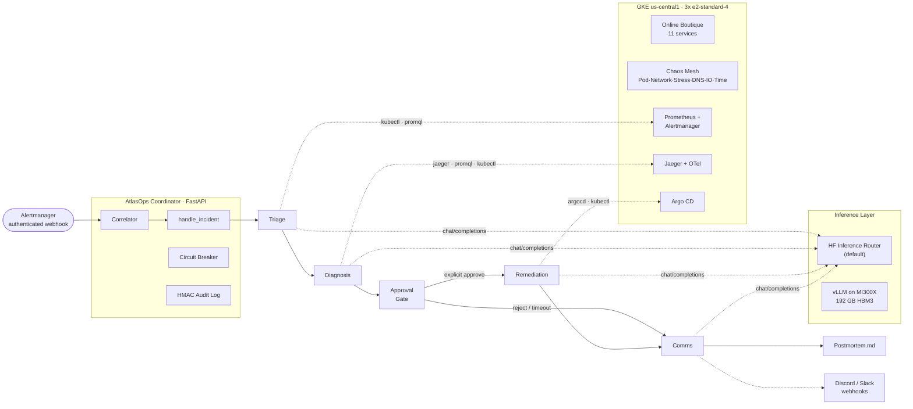

# AtlasOps — Can 4 AI agents replace an on-call SRE team?

> [!IMPORTANT]
> **Current continuation status: NOT_CERTIFIED.** The live results, hardware descriptions,
> and original hackathon commands retained below are historical material, not results
> reproduced by this team. G4 is NOT_PASSED; G6/G8/G12 lack empirical evidence; G9/G13
> are REOPENED. For a safe local presentation, use the read-only
> [Stage 14 demo](docs/project/STAGE_14_DEPLOY_FINAL_DEMO.md) and the
> [current gate inventory](docs/project/MASTER_PIPELINE_STATUS.md). The
> [original README comparison](docs/project/UPSTREAM_README_CURRENT_GAP_MATRIX.md)
> tracks each inherited promise against implementation and evidence. The legacy
> `bench.runner` is mock-only and cannot operate a cluster.

> **Original AMD Developer Hackathon 2026 project** | Upstream GKE, Chaos Mesh,
> Prometheus, and MI300X claims below are historical, not current continuation results.

[](https://github.com/virajchoudhary/AtlasOps/actions/workflows/ci.yml)
[](LICENSE)

**Historical upstream references:** [Hackathon Space](https://huggingface.co/spaces/lablab-ai-amd-developer-hackathon/atlas-ops) and [MI300X evidence narrative](docs/MI300X_EVIDENCE.md).
Neither is a live continuation deployment or a verified team training result. The
original README also advertised a Discord run feed; no current operator feed is
promised by this fork.

---

The inherited AtlasOps design gives 4 specialized AI agents an incident alert and access to 19 role-authorized SRE tools, backed by a registry of 24 wrappers. Live-cluster behavior remains to be reproduced by the continuation team.

The original README reported that **Triage** acknowledged an alert in 47
seconds, **Diagnosis** found a currency-service CPU hog in 3 tool calls,
**Remediation** rolled back through Argo CD, and **Comms** drafted a
postmortem. These are upstream claims, not continuation measurements.

Its reported Cloudflare 2019 cascade replay time was **4 minutes 12 seconds**;
the ~25-minute human comparison was an upstream estimate, not a controlled
comparison in this project.

This is **AtlasOps** — a multi-agent SRE platform designed to learn from SFT and online GRPO, with a bounded, non-executing adversarial proposal generator. Its requested 72B judge identity is not attested. The original MI300X training and dynamic benchmark claims have not been reproduced by this continuation; the legacy benchmark runner is mock-only and does not generate scenarios.

---

## Architecture

This is the inherited target architecture. The continuation has a historical
local Kind G3 acceptance record, but has not certified a live G4 incident or
deployed this GKE/MI300X configuration.


```mermaid
flowchart LR
  subgraph GKE["GKE us-central1 · 3x e2-standard-4"]
    OB["Online Boutique<br/>11 services"]
    CM["Chaos Mesh<br/>Pod·Network·Stress·DNS·IO·Time"]
    Prom["Prometheus +<br/>Alertmanager"]
    Jaeger["Jaeger + OTel"]
    Argo["Argo CD"]
  end

  Alert(["Alertmanager<br/>authenticated webhook"]) --> Corr
  Corr --> Coord

  subgraph Atlas["AtlasOps Coordinator · FastAPI"]
    Coord["handle_incident"]
    Corr["Correlator"]
    CB["Circuit Breaker"]
    Audit["HMAC Audit Log"]
  end

  Coord --> Triage
  Triage --> Diag["Diagnosis"]
  Diag --> Gate["Approval<br/>Gate"]
  Gate -- "explicit approve" --> Rem["Remediation"]
  Gate -- "reject / timeout" --> Comms
  Rem --> Comms
  Comms --> PM["Postmortem.md"]
  Comms -.-> Discord["Discord / Slack<br/>webhooks"]

  Triage -. "kubectl · promql" .-> Prom
  Diag -. "jaeger · promql · kubectl" .-> Jaeger
  Rem -. "argocd · kubectl" .-> Argo

  subgraph LLM["Inference Layer"]
    Router["HF Inference Router<br/>(default)"]
    Local["vLLM on MI300X<br/>192 GB HBM3"]
  end

  Triage -. "chat/completions" .-> Router
  Diag -. "chat/completions" .-> Router
  Rem -. "chat/completions" .-> Router
  Comms -. "chat/completions" .-> Router
```

Full end-to-end sequence diagram with design rationale: [`docs/END_TO_END_FLOW.md`](docs/END_TO_END_FLOW.md)

---

## Track Coverage

### Track 1 — AI Agents & Agentic Workflows
AtlasOps retains a purpose-built multi-agent SRE coordinator. It orchestrates
four specialized roles (Triage, Diagnosis, Remediation, Comms) with tool
calling, human-in-the-loop approval, and alert correlation. The original
design described **four Qwen2.5-7B role models co-hosted on MI300X**; this
continuation has not reproduced that serving configuration.

The project owns these interfaces directly rather than relying on a general
agent orchestration framework:

- **Per-role tool ACLs** enforced at runtime (`ROLE_ALLOWED_TOOLS`) — triage cannot call `argocd_rollback`.
- **Human-in-the-loop approval gate** with token exchange, out-of-band notification, and authenticated `POST /approve`.
- **Circuit breaker** with *semantic* failure classification — rejecting remediation is a human decision, not a system failure, and does not trip the breaker.
- **Incident correlator** deduplicating Alertmanager bursts; browser injection is retired.
- **Reward contracts** with objective verifier authority; the direct-action
  G9 scorer differs from the inherited four-agent dense/episode blend.
- **HMAC-chained audit log** for every agent action.
- **Single SSE stream** designed to drive the operator UI timeline.

Local tests cover these interfaces, not the original live performance claims.

### Track 2 — Fine-Tuning on AMD GPUs
The following is the upstream MI300X design stack, not a verified continuation
training environment or a hardware requirement for the read-only local demo.

| Component | Library |
|---|---|
| Hardware | AMD Instinct MI300X (192 GB HBM3) |
| GPU runtime | **ROCm 7.2** |
| Training framework | **PyTorch** (ROCm wheel) |
| Quantisation | **BitsAndBytes-ROCm** (4-bit NF4 QLoRA, LoRA r=16) + **AWQ** (72B judge) |
| Fine-tuning | **TRL** SFTTrainer + GRPOTrainer (DAPO loss) |
| PEFT | **LoRA** r=16, α=32, target: q/k/v/o/gate/up/down proj |
| AMD kernel optimisation | **Hugging Face Optimum-AMD** — BetterTransformer applied to local inference path (`inference.py`) |
| Serving | **vLLM 0.17.1** (ROCm build — PagedAttention, flash attention for MI300X) |
| Domain | **SRE Operations** — incident triage, root-cause diagnosis, remediation, postmortem authoring |

### Training Evidence

The figures and numbers in this section are inherited upstream claims. The
continuation team has not reproduced the training runs or verified usable
checkpoints; see the current gate inventory before citing results.

**SFT** — 2,028 real trajectories, 254 steps on MI300X in 14 min. Loss dropped 97.8%, token accuracy reached 99.1%.


**Online GRPO** — 60 steps, 4 rollouts each (236 real GKE episodes), 9h 34m on MI300X. Peak reward at step 31 (cascade scenario).


**Historical upstream benchmark claim** — 28 frozen chaos scenarios. Resolution rate: 54% (zero-shot) → 68% (SFT) → **82% (GRPO)**. Judge reward: 0.481 → 0.601 → **0.729**. The continuation team has not yet reproduced these live-cluster results.


Full training narrative: [`docs/TRAINING_STORY.md`](docs/TRAINING_STORY.md) | Raw MI300X evidence: [`docs/MI300X_EVIDENCE.md`](docs/MI300X_EVIDENCE.md) | Benchmark tables: [`docs/BENCHMARKS.md`](docs/BENCHMARKS.md)

---

## Tool Registry and Agent Access

AtlasOps registers **24 SRE tool wrappers**. Role ACLs expose **19** to autonomous agents:

`kubectl_get` · `kubectl_describe` · `kubectl_logs` · `kubectl_top_pods` · `kubectl_rollout` · `kubectl_scale` · `promql_query` · `promql_query_range` · `jaeger_search` · `jaeger_get_trace` · `argocd_list_apps` · `argocd_app_history` · **`argocd_rollback`** · `alertmanager_list_alerts` · `alertmanager_silence` · `chaos_list_experiments` · `chaos_stop_experiment` · `slack_post_update` · **`postmortem_draft`**

Five registered wrappers are intentionally not agent-exposed: `argocd_app_get`, `cloud_monitoring_query`, `gcloud_logs_read`, `kubectl_top_nodes`, and high-risk `kubectl_exec`. Registration does not grant an agent permission to call a tool.

The cluster-mutation quota covers `alertmanager_silence`, `argocd_rollback`, `kubectl_rollout`, and `kubectl_scale`. External communication (`slack_post_update`), local filesystem output (`slack_post_update` and `postmortem_draft`), and high-risk unexposed execution (`kubectl_exec`) are separately classified side effects.

Tool exposure is separate from deployment availability. In particular, the Argo CD wrappers remain registered and role-authorized where applicable, but calls fail closed unless an Argo CD endpoint and credentials are deliberately configured; the first controlled reproduction does not yet guarantee Argo Application ownership.

---

## 28 Frozen Scenarios + Prospective Adversarial Design

| Tier | Count | Examples |
|---|---|---|
| Single-fault | 8 | pod-kill, CPU hog, memory leak, network loss, disk fill, clock skew |
| Cascade | 5 | currency latency → checkout timeout → frontend 5xx surge |
| Multi-fault | 5 | 3 simultaneous faults + red herrings across namespaces |
| Named Replays | 10 | Cloudflare 2019, AWS S3 2017, GitHub 2018, Discord 2022, Knight Capital 2012… |
| **Dynamic adversarial (prospective)** | up to 10 unapproved proposals per explicit batch; none executed | A bounded judge response can produce validated Chaos Mesh YAML outside the checkout |

The static catalogue contains exactly 28 YAML-backed frozen scenarios. The
upstream design allows up to 10 newly generated adversarial scenarios in a
separate run. The standalone [proposal generator](docs/project/DYNAMIC_ADVERSARIAL_PROPOSAL_CONTRACT.md)
validates inputs and writes `GENERATED_UNAPPROVED` artifacts only; no judge
run or CRD admission is evidenced. The legacy runner remains mock-only and
disables generation. Its 10/38 constants are limits, not proof of a generated
run. Generated proposals are not frozen catalogue members.

---

## Production Guardrails

### Human-in-the-loop Approval Gate
- **P0**: manual runbook only — agents produce a step-by-step plan, no auto-execution
- **P1**: explicit approval required; rejection, timeout, or missing decision blocks remediation
- **P2/P3**: eligible for automatic policy handling only in governed execution
- Authenticated `POST /approve` · `GET /approval/pending`

Automatic policy classification does not enable cluster mutation by itself;
governed entrypoints require an explicit live opt-in and named context. The
host-only G4 and standalone G9 listeners bind to their own waiting processes;
the in-cluster service has a separate gate. The G9 channel is explicitly
opt-in and its synthetic tests do not establish a real operator decision.

### Circuit Breaker
Hard stops runaway automation:
- 50 tool calls per incident max
- 10 cluster-mutating remediation actions per hour
- 5 concurrent incidents max
- Trips after 3 consecutive unresolved incidents
- `GET /circuit-breaker/status` · `POST /circuit-breaker/reset`

### Incident Correlator
Alert-storm deduplication — groups alerts from the same service/namespace within a 5-minute window into a single incident chain. Prevents 10 parallel agent chains firing for one cascade failure.

### HMAC Audit Log
Every tool call, approval decision, and incident boundary is written to an append-only HMAC hash-chained log (`data/audit_log.jsonl`). Tamper-evident by design — `verify_integrity()` checks the full chain.

---

## Training Pipeline

### SFT → Online GRPO on AMD MI300X

```
Train-only corpus (currently 64 scenario-derived synthetic demonstrations)
        ↓
  QLoRA SFT  (planned; no completed usable adapter)
        ↓
  Online GRPO  (planned; no completed usable adapter)
        ↓
  Benchmark  (28 frozen; measured model comparisons pending)
```

The corrected GRPO code is designed for true online RL; a completed training run and usable checkpoint have not been verified. In a real authorized run, each training step would:
1. Apply a real Chaos Mesh fault to an authorized controlled cluster
2. Score policy completions in serialized fault/action/cleanup cycles on the shared cluster
3. Execute each parsed structured action and score conclusive objective-verifier observations
4. Compute GRPO advantages and update the policy

The upstream 5k-trajectory target is not the current 64-example synthetic
corpus. Neither is evidence of successful live training.

### What makes our training different from competitors

The table describes the intended online-training design, not a completed
continuation training run or observed model improvement.

| Feature | Standard GRPO | AtlasOps |
|---|---|---|
| Environment | Simulator / offline rewards | **Controlled Kubernetes environment, live kubectl (prospective)** |
| Loss | Standard GRPO | **DAPO** (distributional advantage — more stable on skewed rewards) |
| Reward | Episode-level only | **Dense per-step** (progress delta per tool call) + episode contract |
| Curriculum | Random / fixed | **Spaced repetition** (mastery tracking, [3→6→12→24→48] resurface intervals) |
| Scenario generation | Static | **Bounded non-executing proposals exist; the legacy runner disables dynamic execution** |

### Reward Contract (Anti-Gaming)

The formula below is the inherited four-agent episode/dense contract, not the
current G9 direct-action scorer. Direct G9 uses `0.75` for verified resolution
plus `0.25` times required-check coverage, minus `0.25` for a false resolution
claim; an unscorable observation has no numeric reward. See the
[Stage 9 contract](docs/project/STAGE_9_ONLINE_GRPO.md).

```
R = 0.35 × resolve + 0.20 × evidence + 0.20 × safety + 0.15 × speed + 0.10 × comms
  − command_spam (0.10) − false_resolution (0.25) − unsafe_shortcut (0.20)
  − hallucinated_evidence (0.20) − over_silence (0.10)

Per-step dense signal = progress_delta × 0.8 + 0.1 (forward motion)
                       − 0.1 × rollbacks, × 0.5 if tool_failed
Final blend = 0.70 × episode_contract + 0.30 × dense_step_total (normalised)
```

Tier weights shift: cascade/adversarial penalise 1.25× harder. Named replays require evidence before resolution counts.

---

## Benchmark Results

The table below preserves historical upstream claims. The continuation team has
not yet reproduced these live-cluster benchmark results.

| Model | Resolution | Avg Reward | Cascade | Named Replays |
|---|---|---|---|---|
| Qwen2.5-7B zero-shot | 54% | 0.481 | 40% | 30% |
| AtlasOps SFT | 68% | 0.601 | 62% | 55% |
| **AtlasOps GRPO (MI300X)** | **82%** | **0.729** | **78%** | **72%** |

**Historical upstream claim:** +28 pp improvement from zero-shot baseline → GRPO. Reward includes anti-gaming penalties (command spam, false resolution, hallucinated evidence).

`python scripts/release_gate.py` checks artifact wiring; it does not validate
these historical performance figures. Mock benchmark output is stored in a
run-specific directory and does not auto-update the dashboard's stable
comparison path.

---

## University Continuation & Academic Roadmap (GAI + RL)

This fork (`virajchoudhary/AtlasOps`) continues the upstream baseline (`bf9bd19`) under the G0-G15 Master Pipeline. The project lead adopted v2.2 Sections 1-24 and 26-27 for non-live work on 29 September 2026, then [revised the required scope to GAI + RL](docs/project/GAI_RL_SCOPE_REVISION.md). Section 25 measurement rules remain proposed and unapproved. Implementation is not certification: current gate statuses and missing empirical work are recorded in the [Master Pipeline inventory](docs/project/MASTER_PIPELINE_STATUS.md) and [v2.2 status addendum](docs/project/FINAL_PIPELINE_V22_STATUS.md).

1. **Generative AI Multi-Agent System**: Contract-bound state machine (`Alert → Triage → Diagnosis → Approval Gate → Remediation → Verifier → Comms`) with Train-only, loss-masked SFT trajectories. The existing recommender is optional advisory research, not an incident gate.
2. **Online Reinforcement Learning (GRPO)**: Direct structured policy action, safety/approval and objective environment verification before reward and next state. A completed trained policy is not yet evidenced.
3. **Three-Arm Evaluation (prospective)**: Match base GAI, SFT and SFT+GRPO under common frozen membership and budgets. The Stage 13 runner checks ordered raw membership and hashes, but summary metrics are not yet rederived from raw outcomes; G6/G8 diagnosis-only rows cannot supply incident resolution. The old five-arm constant profiles are historical predetermined output, not an observed comparison. Adversarial population and final-Test authorization remain pending, and the frozen Leaderboard overlaps Train/Val. No three-arm empirical result is claimed.

Full Academic Technical Report: [`docs/AtlasOps_Technical_Report.md`](docs/AtlasOps_Technical_Report.md) | Upstream Audit Report: [`docs/project/UPSTREAM_ALIGNMENT_AUDIT_REPORT.md`](docs/project/UPSTREAM_ALIGNMENT_AUDIT_REPORT.md)

---

## Quick Start

### Prerequisites
- Python 3.11 or 3.12, Docker, Kind, `kubectl`, and Helm for the free-first local path
- A host able to sustain the selected local model alongside the controlled cluster
- Explicit operator-provisioned runtime secrets outside the checkout
- GCP/GKE and AMD MI300X are optional portability/training paths, not local Stage 3 prerequisites

### 1. Check local infrastructure prerequisites
Install the project's Python dependencies from the applicable pinned lock
(for Windows/Python 3.12, `requirements/dev-win-py312.lock`) before starting
the console. Provision protected local secret files and point
`ATLASOPS_SECRET_DIR` at their directory for the Stage 3 check.

```bash
bash infra/local/setup_local.sh --check
```
The mutating `--apply` path requires a separate environment review and
authorization. The retained [v1.1 Free-First local setup reference](docs/project/PIPELINE_V1_1_FREE_FIRST.md)
describes the local path; v2.2 governs current project status and evidence
standards. The Stage 3 operator guide still contains the older optional GKE
procedure. `--check` probes local prerequisites, including Docker
and secrets, but is not live G3 acceptance.

### 2. Open the operator console
```bash
python -m uvicorn app:app --host 127.0.0.1 --port 7871
```

Open `http://127.0.0.1:7871/`. The browser UI is read-only: current process
observations are separate from checked-in historical evidence. It has no web
injection, cleanup, approval, or remediation control. The FastAPI service still
exposes authenticated operational API routes; serving the UI is not a safety
certification or an empirical gate result.

The standalone repository-evidence demo is also available:
```bash
python -m demo.launcher --host 127.0.0.1 --port 7860
```

The web injection and cleanup shortcuts remain retired. Authenticated
Alertmanager webhooks and approvals retain their runtime safety controls.

The FastAPI console is the canonical product UI. It reads current process
observations from the existing incident, health, telemetry, cluster, and audit
endpoints; `/ui/catalog` and the allowlisted `/ui/attempts/{name}` projection
provide checked-in governance and historical evidence. The scenario catalogue
appears only under Evaluations, and runbook ranking remains advisory. The
standalone Gradio console is a read-only repository-evidence companion, not a
second operational control surface.

### Hugging Face Space (prospective, after training and approval)

Set Space secrets: **`HF_TOKEN`**, **`ATLASOPS_USE_HF_INFERENCE=1`**, **`AGENT_MODEL`**, **`JUDGE_MODEL`**.  
Paste your merged GRPO Hub id as `AGENT_MODEL` (merge locally with `training/merge_lora_for_hub.py` under `.[train]`).  
Full checklist: [docs/HF_SPACE_SETUP.md](docs/HF_SPACE_SETUP.md).

### 3. Inspect a scenario

Select a scenario in the Gradio console to inspect its checked-in manifest. No
fault or agent workflow runs. The old `make chaos`, `make chaos-reset`, and web
injection shortcuts fail closed. Real experiments use the governed Stage 4
harness after its full preflight and separate authorization.

### 4. Run the benchmark
```bash
python -m bench.runner --model fixture --mock --adversarial 0
# NON_EMPIRICAL fixture output → bench/results/<run_id>/comparison_table.md
# Real G6/G8/G9 evaluation uses the dedicated checkpoint and split evaluators.
```

### 5. Prepare for training (not an authorized launch)
```bash
# Inspect the governed entrypoints without loading a model or contacting a cluster.
python -m training.sft --help
python -m training.grpo --help
```

The old `--rocm` examples are not valid current commands. Stage 7 requires an
explicit `--model-revision`, a resolved tokenizer revision (the
`--tokenizer-revision` flag defaults to the model revision), a verified
Train-only corpus, a new output path, and approved suitable hardware. Stage 9
additionally requires
a completed SFT parent, a named Kubernetes context, explicit live opt-in, and
a reviewed P1 operator channel before any P1 mutation. See the
[Stage 7 training contract](docs/project/STAGE_7_SFT_DATA_AND_TRAINING.md)
and [Stage 9 execution contract](docs/project/STAGE_9_ONLINE_GRPO.md).
Neither entrypoint has produced a certified continuation checkpoint.

### 6. Run tests
```bash
# Core agent + tool tests
python -m pytest tests/test_tools.py tests/test_coordinator.py tests/test_bench_runner.py -q

# Safety guardrail tests
python -m pytest tests/test_approval.py tests/test_circuit_breaker.py \
                 tests/test_correlator.py tests/test_audit.py -q

# App endpoint smoke tests
python -m pytest tests/test_app_endpoints.py -q
```

### 7. Release readiness gate
```bash
python scripts/release_gate.py --strict
# Writes docs/RELEASE_READINESS.md; artifact checks alone cannot certify G0-G15.
```

---

## Project Structure

```
atlasops/
├── agents/
│   ├── coordinator.py          # FastAPI + full agent chain
│   ├── approval.py             # Human-in-the-loop gate (P0/P1/P2/P3)
│   ├── circuit_breaker.py      # Hard limits on tool calls + mutations
│   ├── correlator.py           # Alert storm deduplication
│   ├── audit.py                # HMAC hash-chained audit trail
│   ├── adversarial_designer.py # Validated, unapproved Chaos YAML proposals
│   ├── judge.py                # Episode scoring
│   ├── stream.py               # SSE thought streaming
│   ├── prompts/                # triage / diagnosis / remediation / comms
│   └── tools/                  # 24 registered wrappers; 19 agent-exposed
├── bench/
│   ├── runner.py               # Mock-only benchmark of the 28 frozen scenarios
│   └── chaos_manifests/        # sf-001..008 · cs-001..005 · mf-001..005 · named_replays/
├── config/
│   └── runtime.py              # Frozen scenarios · reward contract · CurriculumManager · StepRewardTracker
├── training/
│   ├── sft.py                  # QLoRA SFT (4-bit NF4, LoRA r=16)
│   ├── grpo.py                 # Prospective direct-action GRPO with objective reward
│   └── generate_trajectories.py
├── scripts/
│   └── release_gate.py         # Pre-submission readiness checker
├── static/
│   └── index.html              # Read-only operator console
├── tests/                      # 100+ tests across tools, coordinator, bench, safety
├── docs/                       # Postmortems · MI300X evidence · benchmarks
├── infra/                      # GCP provisioning · Helm values
├── app.py                      # FastAPI entry point (HF Spaces)
└── Dockerfile                  # HF Spaces container
```

---

## Upstream MI300X Rationale

- The original design cited 192 GB HBM3 for co-hosting four 7B roles and a
  72B adversarial judge. Its sizing and comparative hardware claims have not
  been reproduced by this team.
- Low-latency inference matters for online RL, but the current direct-action
  code serializes cluster rollouts; no MI300X step-time measurement is claimed.
- ROCm dependency compatibility and usable BF16 training require verification
  on the chosen approved host. The current training CLIs do not accept `--rocm`.

See the [upstream MI300X narrative](docs/MI300X_EVIDENCE.md) for historical
snapshots, not current hardware certification.

---

## License

MIT — see [LICENSE](LICENSE)
