# End-to-End Incident Flow

How a single chaos scenario travels through AtlasOps from button click to Discord notification.

## Sequence Diagram

```mermaid
sequenceDiagram
    participant Judge as Judge / User
    participant UI as Live Ops UI
    participant App as app.py
    participant Coord as Coordinator
    participant Corr as Correlator
    participant CB as Circuit Breaker
    participant LLM as HF Router / vLLM
    participant Tools as SRE Tools
    participant Discord as Discord Webhook

    Judge->>UI: Click scenario (e.g. Pod Kill)
    UI->>App: POST /inject {scenario_id}
    App->>App: kubectl apply (or skip on Space)
    App-->>UI: 200 OK {correlation_id}
    UI->>UI: Start SSE stream, show timeline

    Note over App: 20s delay for alert propagation

    App->>Corr: ingest(alert)
    Corr-->>App: incident_id, should_dispatch=true
    App->>Coord: handle_incident(alert, incident_id)
    Coord->>CB: start_incident()

    rect rgb(30,40,60)
        Note over Coord,LLM: Triage Agent (max 10 turns)
        Coord->>LLM: chat/completions (triage prompt + tools)
        LLM-->>Coord: tool_call: kubectl_get
        Coord->>Tools: kubectl_get(pods)
        Tools-->>Coord: pod status JSON
        Coord->>UI: SSE thought (triage / tool_call)
        Coord->>LLM: tool result + continue
        LLM-->>Coord: conclusion {severity, title, blast_radius}
        Coord->>UI: SSE thought (triage / conclusion)
    end

    rect rgb(30,40,60)
        Note over Coord,LLM: Diagnosis Agent
        Coord->>LLM: chat/completions (diagnosis prompt)
        LLM-->>Coord: tool_call: promql_query, jaeger_search
        Coord->>Tools: promql + jaeger
        Tools-->>Coord: metrics + traces
        Coord->>UI: SSE thoughts
        LLM-->>Coord: conclusion {root_cause, confidence}
    end

    alt P1 severity (approval required)
        Coord->>Discord: Approval required embed
        Coord->>UI: SSE thought (waiting_approval)
        Judge->>UI: Click Approve / Reject
        UI->>App: POST /approve {token, decision}
        App->>Coord: approval callback
    end

    alt Approved or auto-timeout
        rect rgb(30,40,60)
            Note over Coord,LLM: Remediation Agent
            Coord->>LLM: chat/completions (remediation prompt)
            LLM-->>Coord: tool_call: argocd_rollback
            Coord->>Tools: argocd_rollback(app, revision)
            Tools-->>Coord: rollback result
            Coord->>UI: SSE thoughts
            LLM-->>Coord: conclusion {outcome: resolved}
        end
    else Rejected
        Note over Coord: Skip remediation, record approval_rejected
    end

    rect rgb(30,40,60)
        Note over Coord,LLM: Comms Agent
        Coord->>LLM: chat/completions (comms prompt)
        LLM-->>Coord: tool_call: slack_post_update, postmortem_draft
        Coord->>Discord: Closure embed (if webhook configured)
        Coord->>UI: SSE thought (comms / conclusion)
    end

    Coord->>CB: finish_incident(resolved, reason)
    Note over CB: approval_rejected does NOT trip breaker
    Coord->>Discord: Scenario run complete ping (finally block)
    Coord-->>App: full_record
    App-->>UI: Incident complete
```

## Key Design Decisions

**Correlator bypass for UI injects** — Each `/inject` carries a `correlation_id` starting with `inj-`. The correlator always dispatches these as new incidents instead of merging with existing Alertmanager fingerprints. This prevents the second scenario from being silently swallowed when another run is still active.

**Circuit breaker semantics** — Only `system_error` and `agent_error` outcomes count toward the consecutive failure threshold. Designed outcomes like `approval_rejected`, `manual_runbook`, and `approval_timeout` do not trip the breaker, so judges can reject remediation freely without locking the system. The hourly action quota applies only to cluster-mutating remediation tools; external communications and local postmortem writes remain subject to the general per-incident call limit but do not consume cluster-mutation capacity.

**HTTP retry on LLM calls** — The coordinator retries `chat/completions` on HTTP 429 (HF Router rate limit) and 5xx with exponential backoff, preventing transient inference hiccups from failing entire scenarios.

**POST /reset clears everything** — Resets chaos manifests, circuit breaker state, and correlator incident tracking. The UI Reset button is a true panic switch for demos.
