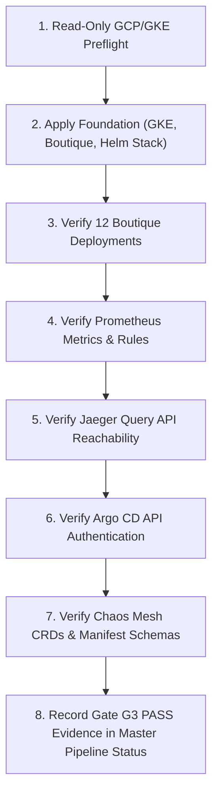

# AtlasOps Gate G3 Live Acceptance Plan

**Document Version:** 1.0  
**Specification Reference:** Master Implementation Pipeline v1.0 (Stage 3 / Gate G3)  
**Status:** STATICALLY SPECIFIED / LIVE VERIFICATION PENDING  

---

## 1. Executive Summary & Objective

Gate G3 requires the formal live verification of the complete AtlasOps operational environment on a controlled, Standard zonal Google Kubernetes Engine (GKE) cluster before Stage 4 (multi-agent trajectory generation) or downstream RL training (Stages 5–15) may begin.

This document defines the non-destructive backend acceptance contracts, exact tool wrappers, endpoint and secret requirements, mutation boundaries, and concrete verification criteria for all six core infrastructure components:

1. **Kubernetes Workloads (Online Boutique)**
2. **Prometheus Monitoring & Alerting Rules**
3. **Alertmanager Webhook Routing**
4. **Jaeger Distributed Tracing Backend**
5. **Argo CD REST API & GitOps Controller**
6. **Chaos Mesh Fault Engine**

> [!IMPORTANT]
> **No-Cloud Pre-Verification Rule**: All contracts in this document are statically verified in CI via Helm templating, manifest linting, and mock regression suites. Live deployment and execution against cloud resources requires explicit authorized operator activation with zero fabricated evidence.

---

## 2. Component Acceptance Matrix

| Component | Pinned Version / Commit | AtlasOps Tool Wrapper | Endpoint & Secret Contract | Mutation Profile | Non-Destructive Live Acceptance Test | Success Condition |
| :--- | :--- | :--- | :--- | :--- | :--- | :--- |
| **Kubernetes & Boutique** | Microservices Demo `98e60f5` (v0.10.0) | `agents.tools.k8s` (`kubectl_get`, `pod_logs`, `deployment_restart`, `deployment_scale`, `cluster_events`) | In-cluster ServiceAccount token / `KUBECONFIG`; RBAC bounded to `default` namespace | Read-Only (diagnosis/triage) & Mutating (remediation) | `kubectl get deployments -n default` and `kubectl rollout status` on all 12 services | All 12 Boutique deployments report `Available`; pod logs and events fetchable |
| **Prometheus** | `kube-prometheus-stack:88.3.0` | `agents.tools.prometheus` (`promql_query`) | `PROMETHEUS_URL=http://prometheus-kube-prometheus-prometheus.monitoring.svc.cluster.local:9090` | Read-Only | Run PromQL query: `kube_deployment_status_replicas_available{namespace="default"}` | HTTP 200 with vector results matching all 12 Boutique deployments |
| **Alertmanager** | `kube-prometheus-stack:88.3.0` | `agents.coordinator` (`/webhook` route) | `ALERTMANAGER_URL=http://prometheus-kube-prometheus-alertmanager.monitoring.svc.cluster.local:9093`, route `atlasops_route: coordinator` with `ALERTMANAGER_WEBHOOK_SECRET` | Read-Only (webhook ingestion / dispatch) | Prometheus rule `AtlasOpsOnlineBoutiqueDeploymentUnavailable` triggers webhook POST | Webhook receives firing payload with valid Bearer token, dispatching incident |
| **Jaeger Tracing** | `jaegertracing/jaeger:4.12.0` | `agents.tools.jaeger` (`jaeger_trace_get`, `jaeger_traces_search`, `jaeger_services_list`) | `JAEGER_URL=http://jaeger.jaeger.svc.cluster.local:16686` | Read-Only | `jaeger_services_list()` calling `GET /api/services` | HTTP 200 with valid JSON response payload `{"data": [...]}`; reachability confirmed |
| **Argo CD** | `argo/argo-cd:10.3.2` | `agents.tools.argocd` (`argocd_list_apps`, `argocd_app_get`, `argocd_app_sync`, `argocd_app_rollback`) | `ARGOCD_URL=http://argocd-server.argocd.svc.cluster.local:80`, `ARGOCD_USER`, `ARGOCD_PASS` from `atlasops-coordinator-secrets` | Read-Only (`list`/`get`) & Mutating (`sync`/`rollback`) | `argocd_list_apps()` calling `POST /api/v1/session` followed by `GET /api/v1/applications` | HTTP 200 with application list; authentication succeeded, 0 apps valid |
| **Chaos Mesh** | `chaos-mesh/chaos-mesh:2.8.3` | `bench.runner` / `bench.chaos` (`apply_chaos`, `reset_cluster`, `clear_chaos_experiments`) | In-cluster CRDs (`chaos-mesh.org/v1alpha1`); container runtime `containerd` | Controlled Fault Injection & Clean-up | Dry-run apply and validation of 28 frozen chaos manifests against CRD schemas | All CRDs registered, chaos daemon pods Running, manifests pass admission |

---

## 3. Detailed Component Contracts

### 3.1 Kubernetes & Online Boutique Foundation
- **Target Namespace**: `default`
- **Required Deployments (12)**: `adservice`, `cartservice`, `checkoutservice`, `currencyservice`, `emailservice`, `frontend`, `loadgenerator`, `paymentservice`, `productcatalogservice`, `recommendationservice`, `redis-cart`, `shippingservice`.
- **Live Acceptance Procedure**:
  1. Inspect all 12 Deployments: `kubectl get deployments -n default -o json`.
  2. Verify replica availability: `availableReplicas == replicas` for all 12 workloads.
  3. Execute `kubectl_get("pods", namespace="default")` via `agents.tools.k8s` to confirm tool execution through coordinator RBAC.

### 3.2 Prometheus Monitoring & Availability Alerts
- **Target Namespace**: `monitoring`
- **Rule Manifest**: `infra/kubernetes/atlasops-prometheus-rules.yaml` (`AtlasOpsOnlineBoutiqueDeploymentUnavailable`)
- **Metric Vector**: `kube_deployment_status_replicas_available / kube_deployment_spec_replicas < 1`
- **Live Acceptance Procedure**:
  1. Execute `promql_query('kube_deployment_status_replicas_available{namespace="default"}')` via `agents.tools.prometheus`.
  2. Confirm 12 active series returned with metric value `1.0`.
  3. Verify Prometheus targets health via Prometheus API `GET /api/v1/targets`.

### 3.3 Alertmanager Webhook Ingestion
- **Target Namespace**: `monitoring` (Alertmanager) $\rightarrow$ `default` (Coordinator Webhook)
- **Authentication**: Bearer token loaded from secret `alertmanager-webhook-secret`.
- **Live Acceptance Procedure**:
  1. Verify Alertmanager configuration contains receiver `atlasops-coordinator` pointing to `http://atlasops-coordinator-svc.default.svc.cluster.local:9099/webhook`.
  2. Dispatch synthetic test alert with valid Bearer token: `POST /webhook`.
  3. Verify coordinator responds HTTP 200 with `{"status": "ok", "dispatched": true}`.

### 3.4 Jaeger Distributed Tracing Backend
- **Target Namespace**: `jaeger`
- **Service Name & Port**: `jaeger.jaeger.svc.cluster.local:16686` (ClusterIP)
- **Backend vs. Trace Ingestion Truth**:
  - `backend_ready` (**G3 Requirement**): Jaeger query API responds to `GET /api/services` and `GET /api/traces`.
  - `trace_ingestion_ready` (**Future Follow-Up**): Online Boutique microservices export spans to Jaeger collector (port 4317/4318). Pinned upstream demo currently lacks OpenTelemetry instrumentation.
- **Live Acceptance Procedure**:
  1. Call `jaeger_services_list()` via `agents.tools.jaeger`.
  2. Verify HTTP 200 response with structure `{"data": [...], "total": N, "limit": 0, "offset": 0, "errors": null}`.

### 3.5 Argo CD REST API & Credential Contract
- **Target Namespace**: `argocd`
- **Service Name & Port**: `argocd-server.argocd.svc.cluster.local:80` (ClusterIP)
- **Credential Architecture**:
  - Secrets are provisioned out-of-band by the operator in `atlasops-coordinator-secrets` (`argocd-user`, `argocd-pass`).
  - AtlasOps does **not** automatically scrape or extract `argocd-initial-admin-secret`.
  - Prefer least-privilege dedicated service accounts/accounts with read-only RBAC for G3 inspection.
- **Application Ownership Policy**:
  - G3 reachability is fully satisfied by querying `argocd_list_apps()` returning `[]` (0 applications).
  - Argo CD will **not** take intrusive ownership over resources managed by `infra/setup.sh` without explicit architecture justification.
- **Live Acceptance Procedure**:
  1. Call `argocd_list_apps()` via `agents.tools.argocd`.
  2. Confirm token exchange via `POST /api/v1/session` succeeds and `GET /api/v1/applications` returns HTTP 200.

### 3.6 Chaos Mesh Fault Engine
- **Target Namespace**: `chaos-mesh`
- **Runtime**: `containerd`
- **Scenarios**: 28 frozen scenarios (SF-001–010, CS-001–005, MF-001–005, HIST-001–008).
- **Live Acceptance Procedure**:
  1. Verify CRDs: `kubectl get crd -l app.kubernetes.io/part-of=chaos-mesh`.
  2. Validate all 28 frozen scenario manifests against live cluster OpenAPI schemas using `kubectl apply --dry-run=server -f <manifest>`.
  3. Verify clean state with 0 active chaos experiments.

---

## 4. Execution Sequence for Gate G3 Closure



---

## 5. Teardown & Cost Guardrails

1. **Destructive Teardown Command**:
   ```bash
   ATLASOPS_TEARDOWN_ACK=DELETE_ATLASOPS_DEVELOPMENT_RESOURCES \
   bash infra/teardown.sh <PROJECT_ID> [REGION] [CLUSTER_NAME] --apply
   ```
2. **Post-Teardown Billing Audit**:
   - Verify cluster deletion: `gcloud container clusters list --project=<PROJECT_ID>`
   - Inspect active resources: `gcloud asset search-all-resources --scope=projects/<PROJECT_ID>`
   - Confirm billing stoppage in GCP Console.
