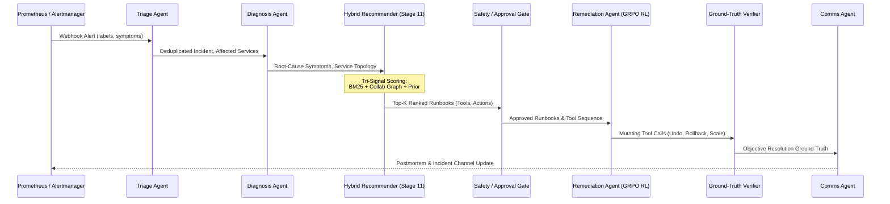

# Stage 12: Integrate GAI + RS + RL (Gate G12)

This technical specification and governance document records the architectural integration of the **Recommender Systems (RS)** layer into the core multi-agent execution pipeline between the **Diagnosis** and **Remediation** agents.

---

## 1. Integrated Multi-Agent Architecture

The complete AtlasOps multi-agent pipeline operates according to the unified flow:

$$\\text{Alert} \\longrightarrow \\text{Triage Agent} \\longrightarrow \\text{Diagnosis Agent} \\longrightarrow \\mathbf{\\text{Hybrid Recommender}} \\longrightarrow \\text{Approval Gate} \\longrightarrow \\text{Remediation Agent} \\longrightarrow \\text{Env Verifier} \\longrightarrow \\text{Comms Agent}$$



---

## 2. Recommender-to-Remediation Payload

When the coordinator processes an incident in `agents/coordinator.py`, the **Hybrid Recommender** generates structured candidate runbooks passed directly into the Remediation Agent's context:

```json
{
  "incident_id": "inc-20260831-7a8f1e",
  "triage": {
    "title": "Pod OOMKilled on checkoutservice",
    "affected_services": ["checkoutservice"],
    "severity": "P1"
  },
  "diagnosis": {
    "root_cause": "OOMKilled container memory limit exceeded 137",
    "confidence": 0.95
  },
  "recommended_runbooks": [
    {
      "runbook_id": "RB-POD-OOM",
      "title": "Pod Out-Of-Memory (OOM) Remediation",
      "category": "resource_exhaustion",
      "score": 0.892,
      "suggested_tools": ["kubectl_describe", "promql_query", "k8s_delete_pod", "k8s_scale_deployment"],
      "actions": ["Inspect memory limits", "Delete crashing pod to trigger clean restart", "Adjust container memory limits"],
      "explanation": "Recommended 'Pod Out-Of-Memory (OOM) Remediation' with confidence 0.89 based on symptom overlap with resource_exhaustion patterns and historical recovery success."
    }
  ]
}
```

---

## 3. Key Benefits of Full GAI + RS + RL Synthesis

1. **Elimination of Remediation Trial-and-Error**:
   - Instead of exploring arbitrary action spaces, the RL-trained Remediation Agent receives top candidate runbooks with targeted `suggested_tools` and structured `actions`.
2. **Deterministic Auditability**:
   - The full incident trajectory (`data/trajectories/<incident_id>.json`) records the exact recommended runbooks and confidence scores alongside agent reasoning.
3. **Fail-Open Resilience**:
   - If the recommender model is unreachable or encounters unknown alert formats, the coordinator fails open gracefully and permits standard autonomous remediation without pipeline interruption.

---

## 4. Gate G12 Acceptance Criteria

Gate G12 is verified by automated unit tests in `tests/test_stage12_integrated_pipeline.py`:
- `test_coordinator_handle_incident_invokes_recommender`: **PASS** (Recommender invoked, payload delivered to Remediation Agent, recorded in trajectory).
- `test_recommender_fails_open_gracefully`: **PASS** (Fail-open exception handling verified).

**Gate G12 Status**: **`PASS`**
