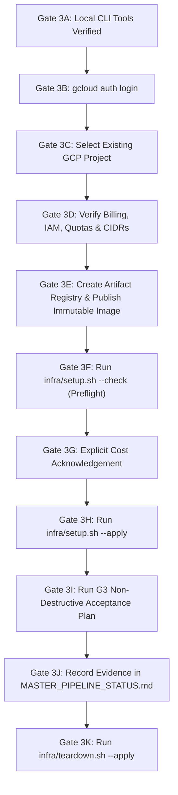

# AtlasOps Stage 3 / Gate G3 Operator Guide & Preflight Package

**Document Version:** 1.0  
**Specification Reference:** Master Implementation Pipeline v1.0 (Stage 3 / Gate G3)  
**Status:** READY FOR OPERATOR ACTIVATION (Cloud Mutation Blocked Pending Operator Authorization)

---

## 1. Overview & Purpose

This document provides the exact contract, input parameters, secret architecture, and end-to-end execution sequence required to execute **Stage 3 (Controlled SRE Environment)** on Google Kubernetes Engine (GKE) and formally validate **Gate G3**.

> [!IMPORTANT]
> **Zero-Cost & No-Cloud Safety Rule**:
> No cloud resources will be provisioned, no GCP APIs enabled, and no gcloud logins performed until the operator explicitly runs the Stage 3 sequence. All previous stages (G0, G1, G2, Runtime Truth, G3 Static Readiness) are 100% validated offline with $0.00 cloud billing.

---

## 2. Operator Input Contract

Before executing `infra/setup.sh --apply`, the operator must supply the following environment variables.

### 2.1 GCP Infrastructure Parameters

| Variable | Requirement / Format | Origin | Notes |
| :--- | :--- | :--- | :--- |
| `PROJECT_ID` / `ATLASOPS_GCP_PROJECT` | `^[a-z][a-z0-9-]{4,28}[a-z0-9]$` | Cloud state | Existing GCP project with billing enabled |
| `REGION` / `ATLASOPS_GKE_REGION` | e.g. `us-central1` | Operator choice | GCP compute region |
| `ZONE` / `ATLASOPS_GKE_ZONE` | e.g. `us-central1-a` | Operator choice | Zonal development cluster constraint |
| `CLUSTER_NAME` / `ATLASOPS_GKE_CLUSTER` | `^[a-z]([a-z0-9-]{0,38}[a-z0-9])?$` | Operator choice | Default: `atlasops-cluster` |
| `ATLASOPS_GKE_NODE_SERVICE_ACCOUNT` | `<name>@<project>.iam.gserviceaccount.com` | Cloud state | Dedicated, least-privilege node service account |
| `ATLASOPS_GKE_AUTHORIZED_NETWORKS` | Comma-separated IPv4 CIDRs (e.g. `203.0.113.10/32`) | Operator network | `0.0.0.0/0` strictly rejected by preflight |

### 2.2 Coordinator Runtime Parameters

| Variable | Requirement / Format | Origin | Notes |
| :--- | :--- | :--- | :--- |
| `ATLASOPS_COORDINATOR_IMAGE` | Pinned digest `${REGION}-docker.pkg.dev/${PROJECT_ID}/atlasops/atlasops-coordinator@sha256:<64-hex>` | Artifact Registry build | Built from `Dockerfile.coordinator` |
| `ATLASOPS_BACKEND` | `vllm`, `fireworks`, or `openai` | Operator choice | Default: `vllm` |
| `ATLASOPS_VLLM_BASE` | HTTP(S) URL without metacharacters | Local/Remote | Endpoint for agent inference |
| `ATLASOPS_AGENT_MODEL` | Valid model identifier | Operator choice | Model name (e.g. `Qwen/Qwen2.5-7B-Instruct`) |

### 2.3 Required Secret Contracts

All secrets are provisioned out-of-band in the cluster before runtime deployment:

#### `default/atlasops-coordinator-secrets`
- `atlasops-audit-secret`: HMAC key for signing audit log entries (generate with `scripts/generate_runtime_secrets.py`).
- `alertmanager-webhook-secret`: Bearer token for authenticating Alertmanager webhook posts.
- `atlasops-api-key`: Header secret (`X-AtlasOps-Key`) for operator approval endpoints.
- `argocd-user`: Dedicated read-only Argo CD username (`atlasops` matching `infra/values/argocd.yaml`).
- `argocd-pass`: Password for the Argo CD read-only user.
- `llm-api-key` (*Optional*): Required only if `ATLASOPS_BACKEND` is `fireworks` or `openai`.

#### `monitoring/atlasops-alertmanager-webhook`
- `alertmanager-webhook-secret`: Must match the value in `default/atlasops-coordinator-secrets`.

> [!CAUTION]
> **Secret Hygiene Rules**:
> 1. Never paste real secret values into documentation, Git commits, or pull requests.
> 2. Never echo or print secret values in shell history or CI logs.
> 3. Use `scripts/generate_runtime_secrets.py` to generate cryptographically strong local secret files (`secrets/` is `.gitignored`).

---

## 3. End-to-End Stage 3 Execution Sequence (Gates 3A–3K)



### Gate 3A: Local Toolchain Verification
Verify local CLI tool versions:
```bash
git --version
bash --version
gcloud version
kubectl version --client
helm version
docker version
```

### Gate 3B: Operator GCP Authentication
Authenticate the operator account against Google Cloud:
```bash
gcloud auth login
```

### Gate 3C: Select Existing Project
Set and confirm the target project ID:
```bash
export PROJECT_ID="<your-project-id>"
export REGION="us-central1"
export ZONE="us-central1-a"
export CLUSTER_NAME="atlasops-cluster"
gcloud config set project "$PROJECT_ID"
```

### Gate 3D: Confirm Billing, Node SA, and Quotas
Verify that billing is enabled and required identities exist:
```bash
gcloud billing projects describe "$PROJECT_ID"
gcloud iam service-accounts describe "<node-sa>@$PROJECT_ID.iam.gserviceaccount.com"
```

### Gate 3E: Create Artifact Registry & Publish Coordinator Image
Google Container Registry (`gcr.io`) is deprecated; use **Google Artifact Registry**:

```bash
# 1. Enable Artifact Registry API
gcloud services enable artifactregistry.googleapis.com --project="$PROJECT_ID"

# 2. Create Docker repository if not present
gcloud artifacts repositories create atlasops \
  --repository-format=docker \
  --location="$REGION" \
  --description="AtlasOps coordinator container repository" \
  --project="$PROJECT_ID"

# 3. Grant node service account read access
gcloud artifacts repositories add-iam-policy-binding atlasops \
  --location="$REGION" \
  --member="serviceAccount:<node-sa>@$PROJECT_ID.iam.gserviceaccount.com" \
  --role="roles/artifactregistry.reader" \
  --project="$PROJECT_ID"

# 4. Authenticate Docker to Artifact Registry
gcloud auth configure-docker "${REGION}-docker.pkg.dev"

# 5. Build container locally
docker build -f Dockerfile.coordinator -t "${REGION}-docker.pkg.dev/$PROJECT_ID/atlasops/atlasops-coordinator:g3-rc" .

# 6. Push to Artifact Registry
docker push "${REGION}-docker.pkg.dev/$PROJECT_ID/atlasops/atlasops-coordinator:g3-rc"

# 7. Extract immutable SHA256 digest
export ATLASOPS_COORDINATOR_IMAGE=$(docker inspect --format='{{index .RepoDigests 0}}' "${REGION}-docker.pkg.dev/$PROJECT_ID/atlasops/atlasops-coordinator:g3-rc")
echo "Pinned Image Digest: $ATLASOPS_COORDINATOR_IMAGE"
```

> [!NOTE]
> **Registry Persistence & Billing**:
> Artifact Registry repositories and images persist independently of GKE cluster lifecycles and may incur small monthly storage charges until explicitly deleted.

### Gate 3F: Read-Only Preflight (`--check`)
Run read-only preflight validation to verify compatibility without cloud mutations:
```bash
bash infra/setup.sh "$PROJECT_ID" "$REGION" "$CLUSTER_NAME" --check
```

### Gate 3G: Explicit Cost Authorization & Secret Preparation
1. Set the required cost acknowledgement environment variable:
```bash
export ATLASOPS_COST_ACK="I_UNDERSTAND_GCP_COSTS"
```

2. Generate local runtime secret material:
```bash
python scripts/generate_runtime_secrets.py --output-dir secrets --argocd-user atlasops
# Write your dedicated operator password to secrets/argocd-pass.secret (gitignored)
```

### Gate 3H: Apply Infrastructure Foundation (`--apply`)
Execute the single-command idempotent bootstrap:
```bash
bash infra/setup.sh "$PROJECT_ID" "$REGION" "$CLUSTER_NAME" --apply
```

**Internal Bootstrap Order Executed by `setup.sh`:**
1. Enables required GCP APIs (`compute`, `container`, `monitoring`, `logging`).
2. Creates or reuses the Standard zonal GKE cluster (`ensure_cluster`).
3. Initializes isolated kubeconfig credentials (`initialize_cluster_access`).
4. Creates all target namespaces (`default`, `monitoring`, `jaeger`, `argocd`, `chaos-mesh`).
5. Deploys Online Boutique (12 Available Deployments in `default`).
6. Installs monitoring & backends via Helm:
   - Prometheus / Alertmanager in `monitoring` (`kube-prometheus-stack:88.3.0`) + Prometheus rules
   - Jaeger in `jaeger` (`jaeger:4.12.0`)
   - Argo CD in `argocd` (`argo-cd:10.3.2`) with dedicated least-privilege `atlasops` account
   - Chaos Mesh in `chaos-mesh` (`chaos-mesh:2.8.3`)
7. Validates runtime secrets (`validate_runtime_secret_contract`). *Note: If secrets were not pre-applied, apply them with `bash secrets/apply_secrets.sh` and re-run `setup.sh --apply` (re-uses existing cluster without recreation).*
8. Renders and deploys coordinator (`deployment/atlasops-coordinator`) in `default` connecting to running backends.

### Gate 3I: Non-Destructive G3 Backend Acceptance
Follow the formal procedures in [`docs/project/G3_ACCEPTANCE_PLAN.md`](G3_ACCEPTANCE_PLAN.md):
1. **Kubernetes & Boutique**: 12 deployments Available in `default` namespace (frontend Service is upstream `LoadBalancer`; AtlasOps internal services are private `ClusterIP`).
2. **Prometheus**: Vector queries verify `availableReplicas == replicas` for all 12 services.
3. **Alertmanager**: Firing alert dispatched to coordinator `/webhook` responds HTTP 200 `{"ok": true, ...}`.
4. **Jaeger**: `jaeger_services_list()` responds HTTP 200 with query backend active.
5. **Argo CD**: `argocd_list_apps()` authenticates via in-cluster ClusterIP and returns `[]`.
6. **Chaos Mesh**: All 28 frozen manifests in `bench/chaos_manifests/` pass `kubectl apply --dry-run=server`.

### Gate 3J: Record Gate G3 PASS Evidence
Update [`docs/project/MASTER_PIPELINE_STATUS.md`](MASTER_PIPELINE_STATUS.md) with:
- GKE Cluster name, zone, and node topology.
- Immutable coordinator image digest.
- Timestamps and raw response outputs from each acceptance check.
- Mark Stage 3 / Gate G3 as **PASS**.

### Gate 3K: Teardown & Cost Guardrails
When testing is complete, destroy all GKE cluster resources to stop ongoing compute charges:
```bash
ATLASOPS_TEARDOWN_ACK=DELETE_ATLASOPS_DEVELOPMENT_RESOURCES \
bash infra/teardown.sh "$PROJECT_ID" "$REGION" "$CLUSTER_NAME" --apply
```
- Verify 0 remaining GKE clusters: `gcloud container clusters list`
- If you wish to delete the container image repository to avoid storage charges:
  `gcloud artifacts repositories delete atlasops --location="$REGION" --project="$PROJECT_ID" --quiet`
- Confirm $0 ongoing compute billing.
