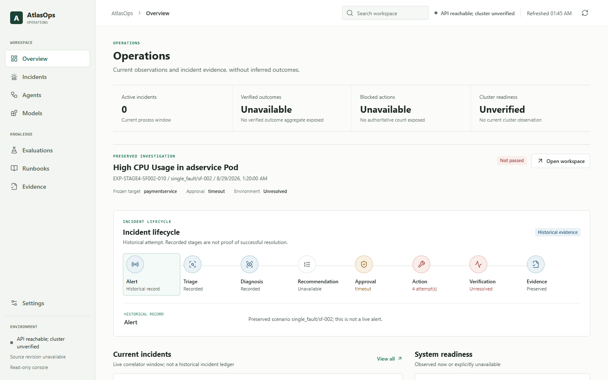
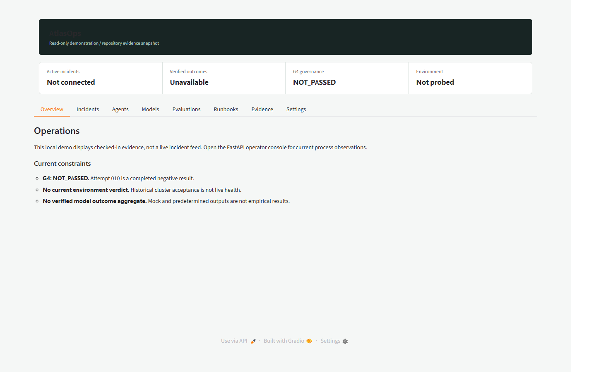

# AtlasOps

## Project continuation and real-validation status

26 September 2026

Current reviewed main: `6cbad8f54c9ec29da3e3e3c9e5446e008b6db12d`

<small>University team continuation of Harikishanth/AtlasOps, upstream baseline
`bf9bd197c9f4a05ae55ade254802a9eef1a74356`. MIT attribution retained.</small>

<!-- Source: AGENTS.md; docs/project/MASTER_PIPELINE_STATUS.md; GitHub main at 6cbad8f. -->

---

## The operator console

The merged UI distinguishes **current process observations** from **historical
incident evidence**. This capture is a local read-only view with cluster health
unverified. It is not a successful remediation demonstration.

<!-- Source: static/console.js; ui_read_model.py; local startup smoke on 2026-09-26. -->

---

## Incident decision path

1. An alert reaches Triage and Diagnosis.
2. The recommender offers advisory runbooks based on scenario-derived data.
3. The safety gate requires explicit P1 approval before remediation.
4. A trained GRPO policy, when one exists, must propose one structured action
   through the tool ACL and environment adapter.
5. The objective verifier determines resolution before Comms records the result.

The direct policy-action software path has local test coverage. **No completed
GRPO checkpoint or real integrated episode has been verified.**

<!-- Source: agents/coordinator.py; agents/tool_policy.py; training/grpo_environment.py; docs/project/MASTER_PIPELINE_STATUS.md. -->

---

## What the evidence supports

- G0-G3 and G5 retain their bounded project milestones. The historical G3
  acceptance report does not prove current cluster health.
- The professional UI and read-only Gradio evidence browser are implemented.
  CI on current main passed frontend contracts and Python 3.11/3.12.
- G10/G11 recommender results use a small scenario-derived interaction set.
  They are not historical operator feedback.
- The submission inventory verifies file integrity and remains
  **NOT_CERTIFIED**.

<!-- Source: docs/project/MASTER_PIPELINE_STATUS.md; artifacts/SUBMISSION_MANIFEST.json; GitHub Actions run 36171143687. -->

---

## G4: the completed attempt was negative

`EXP-STAGE4-SF002-010` is the latest completed result among attempts 009-014.
Its recorded gate verdict is **false** and objective environment resolution is
**false**. The agent targeted adservice instead of the frozen paymentservice
target. Approval timed out, while a criterion marked approval satisfied: an
unresolved inconsistency, not proof of human approval.

Attempts 009 and 011-014 are interrupted or inconclusive. Cleanup for 012-014
failed, so the present cluster state cannot be inferred from those records.

**G4 remains NOT_PASSED.**

<!-- Source: artifacts/evidence/stage4/EXP-STAGE4-SF002-010.json; artifacts/evidence/stage4/RECOVERY_INDEX_009_014.md. -->

---

## Real evaluation dependencies

- G6 needs an approved endpoint with an observed exact model revision and
  preserved raw predictions. Existing Stage 6 outputs are mock evidence.
- G7 needs a suitable BF16-capable GPU and a compatible pinned training
  runtime. G8 then needs a completed, hashed SFT adapter.
- G9 needs a real policy checkpoint and governed environment rollouts. Local
  direct-action tests do not establish trained-policy performance.
- G12 needs that checkpoint and a live, clean controlled environment.
- G13 needs measured artifacts for five variants across Validation, Test,
  Leaderboard, and a predeclared adversarial partition.

No new model or full-pipeline metric was measured for this deck.

<!-- Source: docs/project/STAGE_6_ZERO_SHOT_BASELINE.md through STAGE_13_FINAL_ABLATION_EVALUATION.md; bench/ablation_suite.py. -->

---

## A safe five-minute demo

Show the gate inventory, inspect the preserved G4 negative and interrupted
attempts, then explore advisory runbook ranking. The scenario selector reads a
checked-in manifest; it does not inject Chaos. The Gradio launcher binds to
localhost without a public share link by default.

<!-- Source: demo/launcher.py; dashboard.py; docs/project/STAGE_14_DEPLOY_FINAL_DEMO.md; local startup smoke on 2026-09-26. -->

---

## Closure decision

**Non-live engineering is substantial; scientific closure remains open.**

Current host: Docker Linux engine absent, Kind API unreachable, no approved
model endpoint observed, GTX 1650 with 4 GiB VRAM, and no optional ML training
stack in the local project environment. Independent verifier attempts failed
before findings due to a tool-stream decode error.

Next, an operator must establish a clean disposable Kind environment, confirm
zero active Chaos and an approved model identity, arrange legitimate P1
approval, and then run one predeclared G4 attempt. Suitable training compute
and a frozen adversarial evaluation protocol remain separate prerequisites.

**Package state: NOT_CERTIFIED. No production certification is claimed.**

<!-- Source: current local preflight on 2026-09-26; docs/project/MASTER_PIPELINE_STATUS.md; artifacts/SUBMISSION_MANIFEST.json. -->
